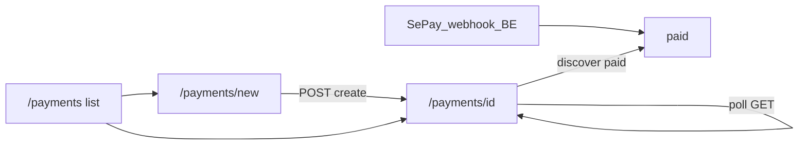

# Prompt: UI thanh toán & lịch sử giao dịch (SePay)

Copy-paste toàn bộ document này vào agent / FE đang làm việc trong **`c:\LocaTrip\my-app`**.

Bạn làm **giao diện thanh toán** cho traveller đã login: tạo đơn → hiện QR SePay → poll trạng thái → lịch sử **của chính user đó**.

**Backend LocalTrip dùng SePay** (không còn VietQR.io Payment Kit). Không sửa server trừ khi user explicit cho phép. Tham chiếu API (read-only):

- `c:\LocaTrip\server\LocalTrip\docs\payments-sepay.md`
- Model: `c:\LocaTrip\server\LocalTrip\src\models\Payment.ts`
- Routes: `c:\LocaTrip\server\LocalTrip\src\routes\payment.routes.ts`
- Webhook: `POST /webhooks/sepay`

---

## Non-negotiables

1. **Auth bắt buộc** — `RequireAuth` + `apiFetch` (Bearer). Role `traveller` | `admin`.
2. **Chỉ gọi same-origin** `/api/payments…`.
3. **Copy tiếng Việt.** Brand: **LocaTrip**.
4. **Lịch sử = đơn thanh toán LocaTrip** (`ownerId` filter ở BE) — không phải sao kê NH.
5. **Không gọi webhook** từ browser. Webhook chỉ BE nhận (`/webhooks/sepay`).
6. **Không gắn trip / bảng giá / refund** trong scope này.
7. Giữ pattern: `MarketingChrome` + CSS gần `/my-trips`.
8. Skeleton đã có — **verify checklist + polish**; giữ contract API dưới đây.

---

## Mục tiêu UX

1. Tạo thanh toán (số tiền + ghi chú) → QR SePay + mã CK (`LT…`) + countdown.
2. Poll đến khi `paid` / `expired` / `cancelled` (BE nhận SePay webhook → DB `paid`).
3. Lịch sử giao dịch của chính họ.

Dev: `PAYMENT_DEV_MODE` → nút `dev-mark-paid` (nếu FE còn giữ).



---

## Auth & proxy

| Việc | Chi tiết |
|------|----------|
| Client fetch | `apiFetch` từ `@/lib/api/http` |
| Proxy Next | `/api/payments` → gateway `/payments` |
| Upstream env | `LOCALTRIP_API_URL` / `NEXT_PUBLIC_API_BASE_URL` = `http://localhost` (Nginx :80). Không gọi `:5000` / `:5003`. |

---

## API contract (FE)

### Types

```ts
type PaymentStatus =
  | "awaiting_transfer"
  | "paid"
  | "expired"
  | "cancelled";

type Payment = {
  paymentId: string;
  ownerId: string;
  amount: number;
  currency: "VND";
  orderCode: number;
  code: string; // mã CK trong nội dung chuyển khoản — SePay webhook match
  status: PaymentStatus;
  checkoutUrl: string; // QR image: qr.sepay.vn / vietqr.app
  sepayTransactionId?: string;
  accountNo?: string;
  bankName?: string; // e.g. TPBank
  accountName?: string;
  expiresAt: string;
  note?: string;
  paidAt?: string;
  mockCheckout?: boolean; // thiếu SEPAY_BANK / ACCOUNT_NO
  createdAt: string;
  updatedAt: string;
};
```

### Endpoints

| Method | Path FE | Body | Response |
|--------|---------|------|----------|
| `POST` | `/api/payments` | `{ amount, note? }` | `{ payment, paymentDevMode }` |
| `GET` | `/api/payments` | `?status=` | `{ payments[], paymentDevMode }` |
| `GET` | `/api/payments/:id` | — | `{ payment, paymentDevMode }` |
| `POST` | `.../cancel` | — | `{ payment }` |
| `POST` | `.../dev-mark-paid` | — | `{ payment }` nếu `paymentDevMode` |

**amount** ≥ 1000 VND.

### Status labels (VN)

| status | Label |
|--------|-------|
| `awaiting_transfer` | Chờ chuyển khoản |
| `paid` | Đã thanh toán |
| `expired` | Hết hạn |
| `cancelled` | Đã hủy |

---

## Ba màn hình

### `/payments/` — Lịch sử

List card: số tiền, badge, mã `code`, thời gian. CTA tạo. Empty/loading/error.

### `/payments/new/` — Tạo

Form amount + note → POST → redirect `/payments/:id`.

### `/payments/[id]/` — Chi tiết / QR

- `checkoutUrl` là ảnh nếu chứa `qr.sepay.vn` / `vietqr.app` / đuôi ảnh → ``.
- Countdown `expiresAt`; poll **3–5s** khi `awaiting_transfer`.
- Hiện `code`, `bankName`, `accountNo`, status.
- Hủy khi đang chờ.
- Hint: đang chờ SePay xác nhận CK.
- `mockCheckout` → hint thiếu cấu hình TK SePay.
- `paymentDevMode` → nút đánh dấu paid (dev).

---

## Skeleton

| Path | Việc |
|------|------|
| `lib/api/payments.ts` | Types + helpers (`isPaymentQrImage`) |
| `app/api/payments/**` | Proxies |
| `app/payments/**` | UI |

---

## Acceptance

- [ ] Login → chỉ thấy payment của mình
- [ ] Tạo → QR + mã `LT…`
- [ ] Poll → `paid` sau webhook BE hoặc `dev-mark-paid`
- [ ] Hủy / hết hạn đúng badge
- [ ] Không gọi `/webhooks/sepay` từ FE
- [ ] Copy không còn “VietQR.io Payment Kit” (QR vẫn có thể là ảnh VietQR chuẩn NAPAS qua SePay)

---

## Out of scope

- Cấu hình dashboard SePay / VA / DN ngân hàng
- Admin payment dashboard
- Gắn `tripId`

## BE prerequisite

`PAYMENT_DEV_MODE=true`, `SEPAY_BANK` + `SEPAY_ACCOUNT_NO` (+ `SEPAY_ACCOUNT_NAME`). Prod: `SEPAY_WEBHOOK_API_KEY` + webhook URL public trên my.sepay.vn. Chi tiết: `docs/payments-sepay.md`.
