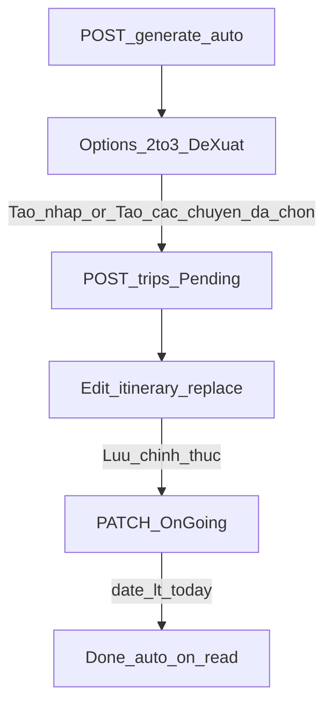

# Prompt: Place detail, replace & tripStatus Pending (layout frozen)

Copy-paste this entire document into an agent working in **`c:\LocaTrip\my-app`**.

You are wiring three product pieces on the existing book-a-trip + my-trips UI:

1. **Full place detail** when the user inspects a stop (incl. `thumbnail` and the rest of the place document).
2. **Suggestion + replace** wired to LocalTrip server APIs (not only local `topAlternatives` / search).
3. **New save lifecycle** with `tripStatus`: create **one or many Pending** trips from generate options → user edits → **Lưu chính thức** → `OnGoing` → after travel `date` → `Done`.

**Do not redesign layout, visual chrome, or phase structure.** If parts already exist, **verify the acceptance checklist** and only fill gaps / fix bugs.

FE talks via same-origin Next proxies (`/api/trips/…` → Bearer via `apiFetch`).

Upstream docs (read-only reference; do not edit server unless this task’s **Backend prerequisite** requires a paired BE change and the user explicitly allows it):

- `c:\LocaTrip\server\LocalTrip\docs\trips-save.md`
- `c:\LocaTrip\server\LocalTrip\docs\CLIENT_AUTH_AND_TRIPS.md`
- Place model: `c:\LocaTrip\server\LocalTrip\src\models\Place.ts`
- Trip routes: `c:\LocaTrip\server\LocalTrip\src\routes\trip.routes.ts`

Related prior FE prompts (do not reopen scope from them unless needed for types):

- `docs/PROMPT_SAVED_TRIP_PREFS.md`
- `docs/PROMPT_BOOK_A_TRIP_GENERATE_REFACTOR.md`

---

## Non-negotiables

1. **Keep layout / phases** in `components/book-a-trip/BookATripView.tsx`: prefs form → location prompt → loading → **options** (multi itinerary) → itinerary + map → replace modal. Keep `/my-trips` list + detail structure — add status chips/filters and CTAs only.
2. **Keep Vietnamese** copy and existing chip/form styling (`AutoTripPrefsFields`, CSS modules).
3. **Brand spelling:** **LocaTrip** (not “LocalTrip”) in any new user-facing strings.
4. **Auth required** for generate, place detail, suggest/replace, create/list/patch (`openAuth` + `apiFetch` Bearer; role `traveller` | `admin`).
5. City remains **Đà Lạt** (`"dalat"`). Auto generate is **always 1 day**.
6. **`title` + `date` required** when creating trips; `date` must be **≥ today** (local) on create. Validate with existing helpers (`validateTripTitleAndDate` / `todayYmd`).
7. **Do not** implement cart generate UI (`/trips/generate/cart`).
8. **Out of scope:** Keycloak theme / realm / IdP — do not touch `keycloak/` or restyle auth.
9. Use **`slimItineraryForSave`** on POST/PATCH itinerary payloads.
10. **Do not** treat Pending as “only client memory before POST” — that is the **old** semantics. Pending trips are **persisted** in Mongo via `POST /trips`.

---

## Product contract — `tripStatus`

| `tripStatus` | UI label | When |
|--------------|----------|------|
| `Pending` | Đề xuất | User creates **1..N** trips from generate option(s) the first time — **saved to DB**, waiting for edit + confirm |
| `OnGoing` | Đang đi | User presses **Lưu chính thức** on a Pending trip |
| `Done` | Hoàn thành | Server derives when travel `date` **&lt; today** (`Asia/Ho_Chi_Minh`); FE **only displays** — never set Done manually |

**Multi-Pending:** On the options screen, allow selecting multiple itineraries (checkboxes **or** multi-CTA) and create **several** `POST /trips` in one action (same prefs / `title`+`date` base, each option’s itinerary), all with `tripStatus: "Pending"`. Also allow creating one option at a time.

Labels already exist in `TRIP_PROGRESS_OPTIONS` (`lib/api/trips.ts`): Đề xuất / Đang đi / Hoàn thành.

---

## Backend prerequisite (read this first)

As of the LocalTrip branch that forced “save = OnGoing”, create may **ignore** client `tripStatus` and always store `OnGoing`, and `Done` is derived on read from `date`.

**Target contract this FE prompt assumes:**

| Write | Behavior |
|-------|----------|
| `POST /trips` + `tripStatus: "Pending"` | Persist draft trip as Pending (default for “Tạo nháp từ options”) |
| `POST /trips` + `tripStatus: "OnGoing"` | Allowed if product ever needs skip-draft; not the primary options CTA |
| `PATCH /trips/:tripId` + `tripStatus: "OnGoing"` | Confirm save (may include updated itinerary + prefs) |
| Client sending `Done` | Ignored; Done only from `date &lt; today` on GET/list |
| `PUT .../replace-place` | Reject if trip is `Done` |

**FE agent instructions if BE is not updated yet:**

- Still implement UI + API client against the **target** fields above.
- Add/adjust TypeScript types and Next proxies.
- Surface a clear toast/error if create returns `OnGoing` when you sent `Pending` (or if confirm PATCH is ignored) — do **not** silently fake status only in React state that disagrees with GET.
- Prefer a short note in the PR/summary: “Needs BE: accept Pending on create + honor OnGoing on PATCH.” Do **not** change the server repo unless the user explicitly asks in the same session.

Reference server routes (already present for place/suggest/replace):

| Method | Path | Role |
|--------|------|------|
| `GET` | `/trips/places/search?q=&limit=` | Search hits (+ `thumbnail`) |
| `GET` | `/trips/places/:placeId` | **Full** place detail |
| `GET` | `/trips/places/:placeId/alternatives?radius=&limit=` | Alternatives near a place |
| `POST` | `/trips/:tripId/suggest-replace` | Context alternatives for a stop |
| `PUT` | `/trips/:tripId/replace-place` | Persist replacement on saved trip |
| `POST` | `/trips` | Create (Pending / OnGoing per contract) |
| `PATCH` | `/trips/:tripId` | Update itinerary / confirm OnGoing |
| `GET` | `/trips`, `/trips/:tripId` | List/detail — includes `tripStatus`, `date` |

---

## Do

### A) Full place detail

- Use existing `getPlaceById` / `PlaceDetail` in `lib/api/trips.ts` (`GET /api/trips/places/:placeId/`).
- When user selects a stop in itinerary/map detail: if `placeId` present and detail not cached, fetch full place.
- Show in the **existing** stop detail panel (no new route):  
  `thumbnail` (route external images through existing **media-proxy** if that is the app pattern), title, category, address, rating + reviewCount, openHours summary, phone / website / menuLink, tags, price range, short busyProfile, a few `userReviews`.
- Loading / 404 / empty states: compact, Vietnamese.
- Search list may show `thumbnail` thumb when present (optional polish).

### B) Suggestion + replace

Add client helpers (and Next.js proxies under `app/api/trips/…` if missing):

| Helper | Upstream |
|--------|----------|
| `getPlaceAlternatives(placeId, { radiusKm?, limit? })` | `GET /trips/places/:placeId/alternatives` |
| `suggestReplaceForTrip(tripId, { dayIndex, scheduleIndex, radiusKm?, limit? })` | `POST /trips/:tripId/suggest-replace` |
| `replacePlaceInTrip(tripId, { dayIndex, scheduleIndex, newPlaceId })` | `PUT /trips/:tripId/replace-place` |

Keep `components/book-a-trip/ReplacePlaceModal.tsx` as the shell:

- **Has `tripId`** (Pending or OnGoing): load suggestions via `suggest-replace` (fallback: `places/:id/alternatives` + search). On pick → `replace-place` → apply returned `itinerary` to UI state (and keep `editingTripId` in sync).
- **No `tripId` yet** (pure generate result, not posted): keep **local** replace on the in-memory option (`topAlternatives` / search / `getPlaceById` for coords) as today; after **Tạo nháp**, subsequent replaces use server APIs.
- Block replace UI when `tripStatus === "Done"`.
- Show thumbnails on alternative rows when available.

Index semantics: match server — `dayIndex` / `scheduleIndex` as used by LocalTrip `suggestContextAlternatives` / `replaceTripPlace` (0-based schedule index inside that day’s `schedule` array). Align with how `ItineraryStop` stores day + scheduleIndex in `lib/itinerary-map.ts`.

### C) Save lifecycle (replaces “save = OnGoing immediately”)

1. **Options phase**
   - Badge **Đề xuất** on each option card.
   - Per-option CTA **Tạo nháp** → one `POST /trips` with `tripStatus: "Pending"`, required `title` + `date`, that option’s itinerary, `source: "auto"`, prefs / `generatePrefs` (same as current `buildSaveBody`, but status Pending).
   - Multi-select + **Tạo các chuyến đã chọn** → sequential or `Promise.all` of N creates (handle partial failure: toast which succeeded).
   - After create: toast + link to `/my-trips` or open edit for the last/first created id (`?edit=`).

2. **My Trips**
   - Show status chip from `TRIP_PROGRESS_OPTIONS`.
   - Add a light filter/tabs: **Đề xuất | Đang đi | Hoàn thành** (client filter on `trip.tripStatus` is enough).
   - Show **Ngày đi** prominently (already started — keep/fix).
   - Pending → primary **Chỉnh**; OnGoing → Chỉnh/Xem; Done → **Xem** only (disable Chỉnh / delete policy: delete still OK unless product forbids — keep delete).

3. **Edit Pending** (`/book-a-trip/?edit=<tripId>`)
   - Prefill draft + itinerary as today (`draftFromSavedTrip`).
   - Primary CTA label **Lưu chính thức** → `PATCH` with `tripStatus: "OnGoing"` + current itinerary/prefs/title/date.
   - Secondary: allow updating itinerary while still Pending without flipping to OnGoing (PATCH without status or keep Pending) — only **Lưu chính thức** sets OnGoing.

4. **OnGoing**
   - Allow itinerary update + replace; do not show “Tạo nháp”.
   - CTA can remain **Cập nhật chuyến này**.

5. **Done**
   - Read-only itinerary; no replace; no status picker.

6. Remove any **manual tripStatus chip picker** on the prefs form (status is lifecycle-driven, not a free enum for users).

---

## Don’t

- Don’t restyle hero, map chrome, or marketing pages.
- Don’t restyle Keycloak.
- Don’t call `/trips/generate/cart`.
- Don’t remove auth or call trips APIs without Bearer.
- Don’t invent multi-day auto.
- Don’t set `Done` from the client.
- Don’t keep “Pending = unsaved generate cards only” as the product meaning.
- Don’t POST full heavy polylines / huge alt lists — slim itinerary.

---

## Same-origin proxies to add/verify

Existing (keep):

- `GET/POST /api/trips/`
- `GET/PATCH/DELETE /api/trips/[tripId]/`
- `GET /api/trips/places/search/`
- `GET /api/trips/places/[placeId]/`
- `POST /api/trips/generate/auto/`

Add if missing (mirror pattern of `proxy-upstream`):

- `GET /api/trips/places/[placeId]/alternatives/`
- `POST /api/trips/[tripId]/suggest-replace/`
- `PUT /api/trips/[tripId]/replace-place/`

---

## Types — `lib/api/trips.ts`

Already have / extend:

- `PlaceDetail`, `PlaceSearchHit` (+ `thumbnail`)
- `TripProgressStatus`, `TRIP_PROGRESS_OPTIONS`
- `CreateSavedTripBody.tripStatus`, `SavedTrip.tripStatus`, `date`

Add request/response types for alternatives / suggest-replace / replace-place (fields: `placeId`, `title`, `category`, `address`, `reviewRating`, lat/lng, `tags`, `distanceKm`, `score`, optional `thumbnail` if BE adds it later).

---

## Key files to touch

| Area | Files |
|------|--------|
| API client | `lib/api/trips.ts` |
| Proxies | `app/api/trips/**` |
| Book flow | `components/book-a-trip/BookATripView.tsx`, `ReplacePlaceModal.tsx`, stop detail UI in same module CSS |
| Draft / validation | `lib/auto-trip-form.ts`, `lib/saved-trip-draft.ts` |
| My trips | `app/my-trips/page.tsx`, `app/my-trips/[tripId]/page.tsx`, `my-trips.module.css` |

---

## Copy (Vietnamese)

| Context | String |
|---------|--------|
| Option badge | Đề xuất |
| Create one | Tạo nháp |
| Create many | Tạo các chuyến đã chọn |
| Confirm Pending | Lưu chính thức |
| Status Pending | Đề xuất |
| Status OnGoing | Đang đi |
| Status Done | Hoàn thành |
| Done blocked | Chuyến đã hoàn thành — chỉ xem |
| Place loading | Đang tải địa điểm… |
| Replace apply | Đã thay điểm dừng |

---

## Acceptance checklist

- [ ] Selecting a stop loads **full** place detail including **thumbnail** when available.
- [ ] With `tripId`, replace modal uses **suggest-replace** (or alternatives) and **replace-place**; itinerary updates from server response.
- [ ] Without `tripId`, local replace still works on generate options.
- [ ] User can create **≥ 2 Pending** trips from options in one multi-create action (or clearly equivalent sequential CTAs documented in UI).
- [ ] Each create sends `tripStatus: "Pending"`, required `title` + `date`, slim itinerary + prefs.
- [ ] **Lưu chính thức** PATCHes `tripStatus: "OnGoing"`.
- [ ] My Trips shows status + ngày đi; filter tabs work; Done is view-only (no replace).
- [ ] Done trips cannot be edited/replaced; error from API surfaced if attempted.
- [ ] Next proxies exist for alternatives / suggest-replace / replace-place.
- [ ] No layout redesign; Vietnamese copy; LocaTrip spelling; no Keycloak / cart work.
- [ ] If BE still forces OnGoing on create, UI does not lie — error/note visible; types still target Pending.

---

## Out of scope

- Redesign marketing / discovery pages  
- Deploying LocalTrip server  
- Cart planner UI  
- Changing Keycloak  
- Building a separate trip CMS  

---

## Suggested implementation order

1. Proxies + `lib/api/trips.ts` helpers/types  
2. Place detail panel on stop select  
3. Replace modal ↔ suggest/replace when `tripId` present  
4. Options multi-Pending create CTAs  
5. My Trips status filter + Done read-only  
6. Edit flow: **Lưu chính thức** → OnGoing  
7. Run through acceptance checklist end-to-end against local API  
