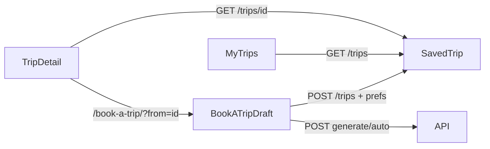

# Prompt: Save & restore trip generate options (layout frozen)

Copy-paste this entire document into an agent working in **`c:\LocaTrip\my-app`**.

You are wiring **persist + restore planner options** (`generatePrefs`) for each user’s saved trips so they can **save after generate** and later **Tạo lại với prefs này** into book-a-trip. **Do not redesign layout, visual chrome, or phase structure.**

If parts of this already exist in the repo, **verify the acceptance checklist** and only fill gaps / fix bugs — do not rewrite unrelated UI.

Backend LocalTrip already has owner-scoped CRUD + nested `generatePrefs`. FE talks via same-origin Next proxies (`/api/trips/…` → Bearer via `apiFetch`).

Upstream docs (read-only reference; do not edit server unless asked):

- `c:\LocaTrip\server\LocalTrip\docs\trips-save.md`
- `c:\LocaTrip\server\LocalTrip\docs\CLIENT_AUTH_AND_TRIPS.md`

---

## Non-negotiables

1. **Keep layout / phases** in `components/book-a-trip/BookATripView.tsx` (form → options → itinerary + map). Keep existing `/my-trips` list + detail structure — only add prefs summary chips/text and CTAs.
2. **Keep Vietnamese** copy and existing chip/form styling (`AutoTripPrefsFields`, CSS modules).
3. **Brand spelling:** **LocaTrip** (not “LocalTrip”) in any new user-facing strings.
4. **Auth required** for generate, save, list, detail, and prefill (`openAuth` + `apiFetch` Bearer; role `traveller` | `admin`).
5. City remains **Đà Lạt** (`"dalat"`). Auto generate is **always 1 day** — do not invent multi-day auto.
6. **Do not** build a full trip editor / PATCH UI in this pass (proxy PATCH may stay unused).
7. **Do not** implement cart generate UI.
8. **Out of scope:** Keycloak theme / realm / IdP screens — do not touch `keycloak/` or restyle auth.
9. Prefill must **not** auto-submit generate — only load the form draft; user clicks create.

---

## Do

- Extend save body types with planner fields + optional nested `generatePrefs`.
- On **Lưu chuyến đi**, persist the **current draft prefs** (same params used for generate), not just title/itinerary.
- Default **`showRoad: false`**; send `draft.showRoad` from builder; add toggle “Hiện đường trên map” (same style as Khứ hồi).
- My Trips **detail**: compact prefs summary from `trip.generatePrefs` or flat fields.
- **Tạo lại** / **Tạo lại với prefs này** → `/book-a-trip/?from=<tripId>` → fetch trip → map prefs → `AutoTripDraft` → show notice → strip query.
- Keep itinerary slim on save (drop heavy OSRM / alt lists) via existing `slimItineraryForSave`.

## Don’t

- Don’t restyle hero, map, option cards, itinerary list, or my-trips card layout beyond CTA + small prefs chips.
- Don’t restyle Keycloak.
- Don’t call `/trips/generate/cart`.
- Don’t remove auth or call trips APIs without Bearer.
- Don’t auto-run generate after prefill.
- Don’t invent breaking API fields; align with `trips-save.md`.

---

## Why (backend contract)

| Endpoint | Role |
|----------|------|
| `POST /trips` | Create saved trip — flat prefs **and/or** nested `generatePrefs` (flat wins on conflict; BE merges) |
| `GET /trips?status=active` | List my trips |
| `GET /trips/:tripId` | Detail — response includes flat fields + `generatePrefs` for prefill |
| `PATCH /trips/:tripId` | Out of scope for UI this pass |
| `DELETE /trips/:tripId` | Existing delete OK |

Same-origin (existing):

- `POST /api/trips/`
- `GET /api/trips` / `GET /api/trips/:id/`
- `POST /api/trips/generate/auto/`

`showRoad` on generate **and** create: default **`false`** when omitted (lighter payload / no polylines). Toggle on → map can show routes.

---

## Flow

---

## 1) Types — `lib/api/trips.ts`

Add `TripGeneratePrefs` and extend `CreateSavedTripBody` / `SavedTrip`:

| Field | Notes |
|-------|--------|
| `tripType`, `targetCustomer` | strings |
| `preferences` | `string[]` tags |
| `budgetLevel`, `pace` | same enums as generate |
| `radiusKm`, `maxDistance` | numbers |
| `isRoundTrip` / `roundTrip` | boolean aliases |
| `startTimePerDay`, `endTimePerDay` | `"HH:MM"` |
| `showRoad` | boolean |
| `startMode?`, `startId?` | `"gps"` \| `"preset"`, preset id |
| `startCoords?` | `{ latitude, longitude }` |
| `generatePrefs?` | nested object — **same keys** — on create body and response |

---

## 2) Generate — `showRoad` from draft

| File | Change |
|------|--------|
| `lib/auto-trip-form.ts` | `DEFAULT_AUTO_TRIP_DRAFT.showRoad = **false**` |
| `lib/build-auto-trip-request.ts` | `showRoad: draft.showRoad` — **stop** hardcoding `true` |
| `components/book-a-trip/AutoTripPrefsFields.tsx` | Toggle **“Hiện đường trên map”** (checkbox row like Khứ hồi) |

---

## 3) Save — `BookATripView.saveCurrentTrip`

Keep existing: `title`, `source: "auto"`, slim `itinerary`, `startCoords`, `durationDays`, `summary`, `pace`.

**Also send** (flat and/or `generatePrefs: { … }`):

- `preferences` via `buildPreferences(draft)`
- `tripType`, `targetCustomer`, `budgetLevel`
- `radiusKm`, `maxDistance` (parsed numbers)
- `isRoundTrip`, `showRoad`
- `startTimePerDay` / `endTimePerDay` from `parseDraftHours(draft.hours)`
- `startMode`, `startId`
- coords used for last generate / active start

Do not invent calendar `startDate` / `endDate`.

---

## 4) My trips — list + detail

| File | Change |
|------|--------|
| `app/my-trips/page.tsx` | Keep `listSavedTrips("active")`. Add CTA **Tạo lại** → `/book-a-trip/?from=<id>` (keep Xem / Xóa). |
| `app/my-trips/[tripId]/page.tsx` | Compact **prefs summary** (chips/text): tripType, pace, budget, round-trip, hours, radius, maxDistance, showRoad, soft prefs labels. CTA **Tạo lại với prefs này** → same `?from=` URL. Keep link “Tạo chuyến mới” without prefill. |

Use `labelForValue` from `lib/auto-trip-form.ts` for tag labels where possible. Prefer `trip.generatePrefs` with fallback to flat fields.

---

## 5) Prefill — restore options into book-a-trip

### Helper (new or existing)

Suggested: `lib/saved-trip-draft.ts`

- `pickSavedTripPrefs(trip)` — merge nested + flat (incl. `startCoords` / `startLatitude`+`startLongitude`)
- `draftFromSavedTrip(trip)` → `{ draft: AutoTripDraft, locationOverride }`
  - Bucket `preferences[]` back into `atmosphere` / `food` / `activities` / `constraints` using form option sets + tag prefixes (`atmosphere:`, `specialty:`, `feature:`, `amenities:`, …)
  - Hours → `joinDraftHours`; `hoursMode` = `preset` if matches `HOURS_OPTIONS`, else `custom`
  - `startMode === "gps"` + coords → `locationOverride` for regenerate/save; preset uses `startId`
  - Fall back to `DEFAULT_AUTO_TRIP_DRAFT` for missing/invalid enums

### `BookATripView`

1. `useSearchParams()` → `from` trip id.
2. Wrap client in **`Suspense`** (`BookATripClient`) — required for `useSearchParams`.
3. When `from` set + authenticated: `getSavedTrip(from)` → `setDraft` + `setLastLocationOverride` → phase `form` → notice e.g. *Đã nạp tiêu chí từ “…”*.
4. `router.replace("/book-a-trip/", { scroll: false })` after apply (avoid re-fetch loops).
5. Unauthenticated → `openAuth({ next: "/book-a-trip/?from=<id>" })` once (don’t spam modal).
6. Clearing notice on first prefs patch is fine.
7. **Do not** auto-call generate after prefill.

---

## Files to touch (expected)

| File | Change |
|------|--------|
| `lib/api/trips.ts` | Types + keep slim save / list / get helpers |
| `lib/auto-trip-form.ts` | Default `showRoad: false` |
| `lib/build-auto-trip-request.ts` | `draft.showRoad` |
| `lib/saved-trip-draft.ts` | **New** map prefs ↔ draft (or equivalent) |
| `components/book-a-trip/AutoTripPrefsFields.tsx` | Road toggle |
| `components/book-a-trip/BookATripView.tsx` | Rich save body + `?from=` prefill |
| `components/book-a-trip/BookATripClient.tsx` | `Suspense` boundary |
| `app/my-trips/page.tsx` | CTA Tạo lại |
| `app/my-trips/[tripId]/page.tsx` | Prefs summary + CTA |
| `app/my-trips/my-trips.module.css` | Minimal styles for prefs chips only if needed |

Do not invent new API routes; proxies already exist.

---

## Test checklist

- [ ] Generate without road toggle → payload `showRoad: false` (or omit); response lighter / no geometries as expected.
- [ ] Toggle road on → `showRoad: true`; map can show routes when geometries present.
- [ ] Save after generate (logged in) → `GET /trips` includes the trip for that user.
- [ ] `GET /trips/:id` returns `generatePrefs` (or flat equivalents); detail shows summary chips.
- [ ] **Tạo lại** from list/detail → form chips/hours/radius/round-trip/showRoad match saved prefs.
- [ ] Logged out + `?from=` → auth opens with next back to prefill URL; after login, draft loads.
- [ ] Prefill does **not** auto-generate.
- [ ] Auth still required for generate / save / my-trips (`RequireAuth` / Bearer).
- [ ] Layout unchanged aside from small toggle, prefs summary, CTAs.

---

## Acceptance

- Save persists full planner options usable for regenerate/prefill.
- Detail surfaces prefs; **Tạo lại với prefs này** restores draft correctly.
- `showRoad` defaults false and is user-controllable.
- No PATCH editor, cart UI, or Keycloak changes.
- Typecheck / lint clean on touched files.

---

## Out of scope

- Prefill auto-submit generate
- PATCH edit-trip UI
- Pagination (unless list already broken without it)
- Cart generate UI
- Keycloak / realm / IdP restyle
- Multi-day auto

---

## Implementation order (suggested)

1. Types (`TripGeneratePrefs`, create/saved bodies).  
2. `showRoad` default + builder + toggle.  
3. Enrich `saveCurrentTrip` body.  
4. Detail prefs summary + list/detail CTAs.  
5. `draftFromSavedTrip` + `?from=` prefill + Suspense.  
6. Manual test checklist / fix gaps only.
